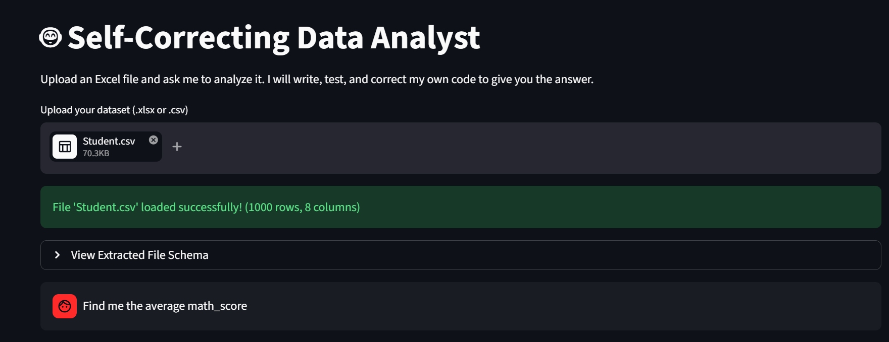
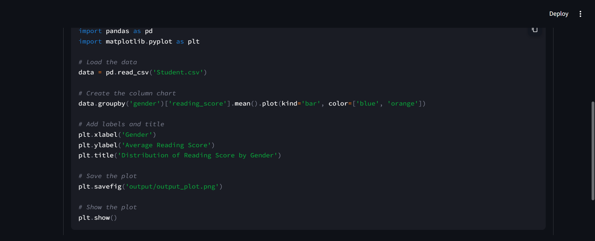
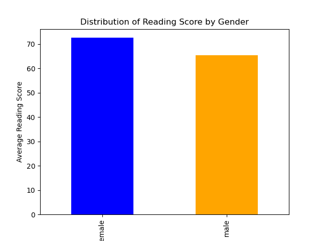

# 🤖 Self-Correcting Data Analyst (Agentic EDA)

[](https://github.com/prakhar-189/Agentic-Data-Analyst-Assistant/actions/workflows/ci.yml)

**Ask a dataset a question in plain English — the agent answers with runnable Python, a SQL query, or an Excel formula, and rewrites its own code when it errors, until it works.**

Built as a stateful [LangGraph](https://github.com/langchain-ai/langgraph) workflow with a **local** LLM ([Qwen2.5-Coder:7b](https://ollama.com/library/qwen2.5-coder) via Ollama) and a [Streamlit](https://streamlit.io/) chat UI. No data leaves your machine.

### Three answer modes
| Mode | What it does | Executed & self-correcting? |
|---|---|---|
| 🐍 **Python** | Writes & runs pandas/matplotlib analysis, returns results + charts | ✅ yes (isolated subprocess) |
| 🗃️ **SQL** | Writes a query, runs it against your data via an in-memory SQLite table | ✅ yes (real query results) |
| 📊 **Excel** | Writes an Excel formula for you to paste into a sheet | ❌ generate-only (formulas can't be executed in Python) |

The Python and SQL modes both flow through the same **Generate → Execute → Reflect** loop — a bad column name or an unquoted `"Order ID"` in SQL errors, and the agent fixes it. Excel is generate-only and honestly labeled as such.



---

## 📊 Does the self-correction actually help? (measured)

The whole premise is the **Generate → Execute → Reflect** loop, so I built a benchmark ([`evaluation/benchmark.py`](evaluation/benchmark.py)) to measure whether it does anything. It runs 16 natural-language questions across the two sample datasets and records, per task, whether the **first** generated program ran, whether the **final** program ran (i.e. after self-correction), and how many attempts it took.

| Task set | Tasks | First-try success | **Final success (after self-correction)** |
|---|---|---|---|
| Easy (well-specified) | 10 | 100% | 100% |
| Hard (pandas-3.0 gotchas) | 6 | 33% | **83%** |
| **Overall** | **16** | **75%** | **94%** |

**Self-correction lifted end-to-end success from 75% → 94%.** On the harder tasks — phrasings whose obvious solution trips a real pandas-3.0 change (naive `df.corr()` and `df.groupby(...).mean()` now *raise* on mixed-type frames, where pandas 2.x silently dropped non-numeric columns) — the model failed on the first try 4 times and **fixed 3 of them by itself** on the retry. One task it could not fix within 3 attempts and gave up gracefully.

> **What "success" means here:** *the generated code executed without error* — the loop's own success criterion. It does **not** verify the answer is semantically correct (that needs human grading). So these numbers measure executable-code rate and, crucially, the self-correction **rescue rate**, not analytical correctness. Full per-task results: [`evaluation/benchmark_results.json`](evaluation/benchmark_results.json).

A concrete rescue: asked for a correlation heatmap, the model first wrote `df.corr()` → `ValueError: could not convert string to float` → the reflect step read the traceback and rewrote it with `numeric_only=True` → success on attempt 2.

---

## How It Works

```
                ┌─────────────┐
   question ───▶│  GENERATE   │  LLM writes Python from the request + schema
                └──────┬──────┘
                       ▼
                ┌─────────────┐   success ──▶ return output + charts
                │  EXECUTE    │──────────────────────────────────────▶
                └──────┬──────┘
                       │ error (traceback)
                       ▼
                ┌─────────────┐
                │  REFLECT    │  LLM reads the error and rewrites the code
                └──────┬──────┘
                       └───▶ back to EXECUTE  (up to 3 attempts, then stop)
```

If the request references columns that aren't in the schema, the agent instead returns a `CLARIFICATION_NEEDED` question rather than hallucinating.

---

## 🔒 A note on the code sandbox (honest version)

The agent runs LLM-generated code, so isolation matters. Generated code executes in an **isolated subprocess** with:

- a **hard timeout** (kills runaway / infinite-loop code — the old version ran a bare `exec()` in-process with no timeout, so a single `while True:` would hang the whole app),
- a **throwaway temp working directory** (the dataset is copied in, charts are collected out as bytes; the code can't see or clobber the repo or other runs),
- a keyword **denylist** as cheap defense-in-depth (now also blocking `__import__`, which trivially bypassed the old `import os` check).

**This is a real improvement, but it is not a true security sandbox.** The subprocess still runs with your OS permissions, so a determined payload could touch the filesystem via an absolute path. Genuine isolation would need a container / gVisor / firejail. This is fine for a local, single-user tool with a non-adversarial local model — and it's stated honestly rather than sold as "safe."

---

## 🐛 What was fixed in this rebuild

- **No execution isolation or timeout** → subprocess + timeout + temp-dir isolation (above).
- **Stale/wrong chart bug**: the UI scanned a shared `output/` folder and displayed an arbitrary PNG (`png_files[0]`), leaking charts across runs and showing only one. Charts now flow back through agent state as in-memory bytes; every chart from a run is shown, nothing leaks.
- **No evaluation**: the core feature was unmeasured. Added the benchmark above.
- **Broken README clone command**: it referenced a repo name (`Agentic-EDA-Engine`) that doesn't exist. Fixed to the real repo.
- **Uploaded file dumped in the repo root** and never cleaned up → written to a temp path instead.
- **72-line `pip freeze`** `requirements.txt` (full of Streamlit's transitive deps) → 8 direct dependencies.
- **No tests / CI** → pytest suite (executor sandbox, security block, timeout, and graph routing) + GitHub Actions. Tests need **no** running Ollama.

---

## Features

- 🗣️ Natural-language querying over `.csv` / `.xlsx`
- 🔁 Self-correcting execution (measured above)
- 📊 Chart generation (matplotlib / seaborn), shown inline
- 🗂️ Schema-aware prompting (column names, dtypes, sample rows)
- 🔒 Fully local via Ollama — no external API calls
- 🧾 Transparent: view the final executed code and correction count

---

## Project Structure

```
Agentic-Data-Analyst-Assistant/
├── main.py                # LangGraph state graph (generate / execute / reflect)
├── streamlit_app.py       # Chat UI
├── prompts.py             # Generator + reflection prompt templates
├── tools.py               # Isolated subprocess executor (timeout + temp dir)
├── evaluation/
│   └── benchmark.py       # Self-correction benchmark (resumable, checkpointed)
├── tests/                 # pytest: executor sandbox + graph routing
├── Sample Datasets/       # Example CSV / XLSX to try
├── requirements.txt
└── .github/workflows/ci.yml
```

---

## Getting Started

### Prerequisites
- Python 3.9+
- [Ollama](https://ollama.com/) running locally with the model pulled:
  ```bash
  ollama pull qwen2.5-coder:7b
  ```

### Install & Run
```bash
git clone https://github.com/prakhar-189/Agentic-Data-Analyst-Assistant.git
cd Agentic-Data-Analyst-Assistant

python -m venv venv
venv\Scripts\activate            # source venv/bin/activate on Linux/Mac
pip install -r requirements.txt

streamlit run streamlit_app.py
```

### Run the benchmark
```bash
python -m evaluation.benchmark    # needs Ollama running; resumable + checkpointed
```

### Tests
```bash
pip install -r requirements-dev.txt
pytest tests/ -v      # no Ollama needed
ruff check .
```

---

## Example: generated code + result

The agent generates and runs code like this, then shows the chart:




---

## Tech Stack

| Component | Technology |
|---|---|
| Agentic workflow | LangGraph |
| LLM (local) | Qwen2.5-Coder:7b via Ollama |
| LLM interface | langchain-ollama |
| UI | Streamlit |
| Data / viz | pandas, matplotlib, seaborn |
| Testing / CI | pytest, ruff, GitHub Actions |

---

## Limitations & next steps

- **Not a security sandbox** (see above) — a container would be the real fix.
- **"Success" = code runs**, not answer-is-correct; a semantic-correctness eval (checking outputs against ground truth) is the natural next step.
- **Local-model dependent**: quality and speed track your hardware and the Qwen model.
- The 3-attempt correction cap is a deliberate guard against runaway loops.

---

## License

MIT © Prakhar Srivastava

---

## Author

**Prakhar Srivastava** — [github.com/prakhar-189](https://github.com/prakhar-189)
Data Analyst · Data Scientist · AI Engineer
